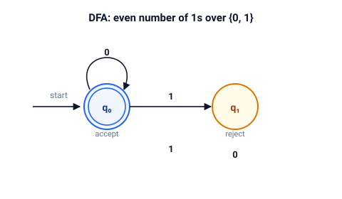

# automata

Finite automata and regular languages.

Deterministic and nondeterministic automata over `char` alphabets, the subset construction, and the classic language operations — complement, union, intersection, difference.

## Quick start

```bash
cargo test
cargo run --example even_ones
```

## The model

### DFA

A DFA is a tuple $(Q, \Sigma, \delta, q_0, F)$.
It accepts a word $w$ when the extended transition function lands in an accepting state:

$$ L(M) = \{ w \in \Sigma^* \mid \hat\delta(q_0, w) \in F \} $$



The diagram shows the smallest useful example: words over $\{0, 1\}$ with an even number of `1`s.
State $q_0$ is both the start and the only accepting state.
Reading a `1` flips it, reading a `0` keeps it.

Transitions are stored as a table, and a missing entry is an implicit trap state: reaching it rejects the word.

### NFA

An NFA relaxes determinism in three ways:

|             | DFA                    | NFA                                   |
| ----------- | ---------------------- | ------------------------------------- |
| on a symbol | exactly one transition | any number of transitions             |
| for free    | nothing                | epsilon-transitions that read nothing |
| acceptance  | the run ends in $F$    | some run ends in $F$                  |

$$ L(N) = \{ w \in \Sigma^* \mid \hat\delta(E(\{q_0\}), w) \cap F \neq \varnothing \} $$

Here $E(S)$ is the epsilon closure: all states reachable from $S$ by epsilon-transitions, $S$ included.

### Subset construction

The subset construction turns an NFA into an equivalent DFA whose states are epsilon-closed sets of NFA states:

$$ \delta'(R, a) = E\left( \bigcup_{q \in R} \delta(q, a) \right) $$

A DFA state is accepting when its set contains an accepting NFA state.
A transition to the empty set is left undefined, which the DFA treats as the trap.

## Demos

| Demo           | Shows                                                                                       |
| -------------- | ------------------------------------------------------------------------------------------- |
| `even_ones`    | A DFA for an even number of `1`s, checked word by word                                      |
| `nfa_to_dfa`   | The subset construction on the NFA for words containing `00` or `11`, with agreement checks |
| `language_ops` | Complement, union, intersection, and difference on two DFAs via the product construction    |

`nfa_to_dfa` determinizes a five-state NFA into a DFA and compares the two machines on every test word.
The verdict `ok` on each line confirms that the subset construction preserved the language.

## API

| Type  | Purpose                                             | Key methods                                                                                             |
| ----- | --------------------------------------------------- | ------------------------------------------------------------------------------------------------------- |
| `Dfa` | Deterministic automaton                             | `accepts`, `is_empty`, `equivalent_to`, `complete`, `complement`, `union`, `intersection`, `difference` |
| `Nfa` | Nondeterministic automaton with epsilon-transitions | `epsilon_closure`, `accepts`, `to_dfa`                                                                  |

## Tests

Unit tests live next to the code in `src/`.
They cover:

- acceptance word by word and rejection of symbols outside the alphabet
- emptiness of the language and the complement law $\overline{\overline{L}} = L$
- union, intersection, and difference against set algebra
- equivalence of structurally different machines with one language
- the epsilon-closure laws

Doc-tests cover every public method.
