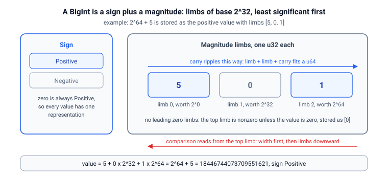

# bignum

Школьная длинная арифметика: знак плюс модуль из лимбов базы $2^{32}$.

Крейт показывает длинную арифметику в самой простой форме.
Число это массив лимбов от младшего к старшему, без ведущих нулей, плюс отдельный знак.
Сложение, вычитание, умножение, деление и сравнение работают как на бумаге, столбик за столбиком.
Значения растут дальше любой фиксированной ширины: демки печатают целиком $100!$ со 158 цифрами и тысячное число Фибоначчи с 209 цифрами.

## Быстрый старт

```bash
cargo run --example big-arithmetic
cargo run --example overflow-u64
cargo run --example factorial-fibonacci
cargo test
```

## Модель

### Лимбы и знак

`Magnitude` хранит неотрицательное целое в базе $B = 2^{32}$, младший лимб первым:

$$v = d_0 + d_1 B + \dots + d_{n-1} B^{n-1}, \qquad 0 \le d_k < B$$

Два инварианта держатся в каждый наблюдаемый момент: массив лимбов никогда не пуст, а старший лимб ненулевой, если только значение не ноль, которое хранится единственным лимбом $[0]$.
`BigInt` добавляет к модулю знак, и нулевой модуль всегда получает положительный знак, так что у каждого значения ровно одно представление.



### Сложение, сравнение, вычитание

Сложение выравнивает операнды по младшему концу и гонит перенос вверх: лимб плюс лимб плюс перенос влезает в `u64`, младшие 32 бита остаются на месте, остальное уходит на лимб выше.
Сравнение читает со старшего лимба: разная длина уже упорядочивает значения, а равная длина сравнивается от старшего лимба вниз.
Производный `Ord` для массива лимбов сравнивал бы младшие лимбы первыми и объявлял $1 > 2$ для $[1]$ против $[0, 1]$.
Вычитание модулей занимает лимб за лимбом и определено только для $a \ge b$.
Знаковый слой строит общий случай на нём: разные знаки вычитают меньший модуль из большего и сохраняют знак большего.

### Умножение

Умножение это школьная схема за $O(n \cdot m)$: каждая пара лимбов даёт один произведение двойной ширины, а перенос каждой строки нормализует массив в том же проходе.
Оценки границ оставляют ячейку `u64` безопасной: ячейка ниже $B$, произведение лимбов ниже $B^2$ и перенос ниже $B$ дают в сумме не больше $2^{64} - 1$.

### Деление и десятичная печать

Деление работает сдвигами и вычитаниями от старшего бита: текущий остаток удваивается, опускается очередной бит делимого, и делитель вычитается, когда влезает.
Тот же `divmod` обслуживает десятичную конвертацию, которая делит на $10^9$ и снимает по девять цифр за проход.

## Демо

| Демо                  | Что показывает                                                                                    |
| --------------------- | ------------------------------------------------------------------------------------------------- |
| `big-arithmetic`      | сложение, вычитание, умножение и деление двух 39-значных чисел, все результаты печатаются целиком |
| `overflow-u64`        | первое переполнение факториалов и чисел Фибоначчи в `u64` и точный пересчёт тех же значений       |
| `factorial-fibonacci` | рекорды $100!$ и $F_{1000}$, число цифр по шагам и проверки делимости                             |

Пример вывода `overflow-u64`:

```text
factorial: 20! still fits, 21! does not
  20! = 2432902008176640000 still fits u64
  21! = 51090942171709440000 no longer fits
  the crate computes 30! = 265252859812191058636308480000000 (33 decimal digits)
```

## API

| Элемент          | Назначение                                                                           |
| ---------------- | ------------------------------------------------------------------------------------ |
| `Magnitude`      | неотрицательные целые как лимбы базы $2^{32}$, с `+`, `-`, `*`, `divmod` и `Display` |
| `BigInt`, `Sign` | знак плюс модуль: знаковая арифметика, порядок и `Display`                           |
| `factorial(n)`   | $n!$ повторными умножениями                                                          |
| `fibonacci(n)`   | $F_n$ с $F_1 = F_2 = 1$, итерацией по парам                                          |
| `SplitMix64`     | засеянный генератор для рандомизированных проверок свойств                           |

## Тесты

- инварианты представления: без ведущих нулей, ноль как $[0]$ с положительным знаком
- перенос, заём и сравнение сверяются с `u128` на засеянных случайных операндах
- знаковая арифметика и порядок сверяются с `i128` на сотнях случайных пар
- свойства кольца на случайных тройках: коммутативность, ассоциативность, дистрибутивность, согласованность порядка
- деление, обращающее умножение, и соседнее тождество $F_{n+1} = F_n + F_{n-1}$ далеко за 64 битами
- рекорды приколоты к точным десятичным строкам, включая 24 хвостовых нуля у $100!$
