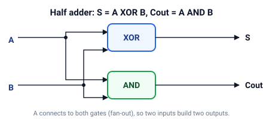

# circuits

Комбинационные схемы как DAG из вентилей.

Вентиль ссылается только на узлы, созданные раньше него, поэтому построитель хранит список узлов в топологическом порядке, и ацикличность выполняется по построению.
Симуляция — один упорядоченный проход, а схему измеряют два числа: **размер** (число вентилей) и **глубина** (самый длинный путь от входа к выходу).

## Быстрый старт

```bash
cargo run --example half_adder
cargo run --example ripple_carry
cargo run --example fuzz
cargo test
```

## Как это устроено

### Вентили и узлы

Схема — это ориентированный ациклический граф: источники — первичные входы и константы 0/1, внутренние узлы — логические вентили (AND, OR, XOR, NOT), стоки — выходы.
Создайте `Circuit`, задайте его источники, затем объединяйте их в вентили.
Каждый конструктор возвращает `NodeId`, на который могут ссылаться последующие вентили, так что один выход может питать много входов (fan-out).

```rust
use circuits::Circuit;

let mut c = Circuit::new();
let x = c.input(0);
let y = c.input(1);
let z = c.input(2);
// Размер 3, глубина 2: AND и NOT параллельны, затем OR ждёт оба.
let f = c.or(c.and(x, y), c.not(z));
assert_eq!(c.size(), 3);
assert_eq!(c.depth(), 2);
assert!(c.eval(f, &[true, true, false]).unwrap());
```

### Размер и глубина

Размер — это число вентилей, стоимость в железе.
Глубина — самый длинный путь от входа к выходу, задержка сигнала.
Источники сидят на глубине 0, и каждый вентиль добавляет единицу к самому глубокому своему входу, поэтому параллельные ветви считаются один раз:

$$d(\text{источник}) = 0 \qquad d(\text{вентиль}) = 1 + \max_{\text{входы}} d(\text{вход})$$

### Сумматоры

Сквозной пример — сложение.
Полусумматор — два вентиля, полный сумматор — пять (два XOR, два AND, один OR), причём `A XOR B` вычисляется один раз и разделяется суммой и переносом:

$$S = A \oplus B \qquad C = A \land B$$

$$S = A \oplus B \oplus C_{in} \qquad C_{out} = (A \land B) \lor \bigl(C_{in} \land (A \oplus B)\bigr)$$

Соединение `n` полных сумматоров даёт сумматор с последовательным переносом.
Перенос проходит через каждый бит, поэтому размер и глубина растут линейно с разрядностью.



## Демо

| Демо           | Что показывает                                                                           |
| -------------- | ---------------------------------------------------------------------------------------- |
| `half_adder`   | Таблицы истинности полусумматора и полного сумматора, размер и глубина каждого           |
| `ripple_carry` | 4-битная трасса `0111 + 0001 = 1000`, затем более широкая сумма, сверённая с арифметикой |
| `fuzz`         | Случайные операнды на многих битовых ширинах, сверенные с целочисленным сложением        |

## API

| Элемент                                  | Назначение                                                              |
| ---------------------------------------- | ----------------------------------------------------------------------- |
| `Circuit::new`                           | Свежая пустая схема                                                     |
| `Circuit::input(i)`                      | `i`-й первичный вход (создаётся один раз, затем переиспользуется)       |
| `Circuit::constant(v)` / `zero` / `one`  | Константы 0/1                                                           |
| `Circuit::and` / `or` / `xor` / `not`    | Добавить вентиль и вернуть его `NodeId`                                 |
| `Circuit::size`                          | Число вентилей (площадь)                                                |
| `Circuit::depth` / `node_depth`          | Самый длинный путь от входа к выходу (задержка)                         |
| `Circuit::simulate` / `eval`             | Один топологический проход для вычисления всех выходов                  |
| `Circuit::node_count` / `input_count`    | Все узлы (источники и вентили) / различные первичные входы              |
| `half_adder`                             | `S = A XOR B`, `C = A AND B`                                            |
| `full_adder`                             | `S = A XOR B XOR Cin`, `Cout` — функция большинства                     |
| `ripple_carry_adder(n)`                  | Цепочка из `n` полных сумматоров, размер и глубина `O(n)`               |
| `Adder::add` / `add_exact` / `add_bits`  | Вычислить сумматор для целых чисел или битовых срезов                   |
| `bits_of` / `value_of`                   | Преобразование между целыми числами и битовыми срезами от младшего бита |

## Тесты

- таблицы истинности полусумматора и полного сумматора
- размер и глубина, включая правило, что параллельные ветви считаются один раз
- переиспользование входов и констант, ошибки отсутствующих входов
- 4-битная трасса с последовательным переносом и сверка сумматора с целочисленной арифметикой
- преобразования битов
