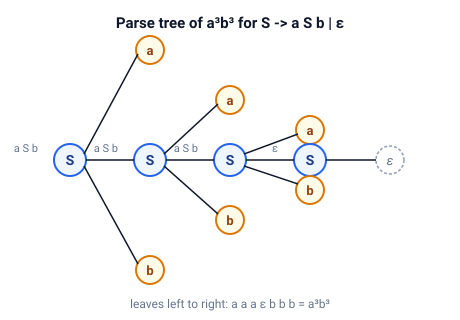

# context-free

Контекстно-свободные грамматики и языки.

Грамматики, деревья разбора, нормальная форма Хомского и распознавание CYK.

## Быстрый старт

```bash
cargo test
cargo run --example cnf_cyk
```

## Модель

Контекстно-свободная грамматика — это кортеж $G = (V, \Sigma, P, S)$: нетерминалы $V$, терминалы $\Sigma$, продукции $A \to \alpha$ и начальный символ $S$.
Она порождает язык

$$ L(G) = \{ w \in \Sigma^* \mid S \Rightarrow^* w \} $$

У слова может быть несколько выводов.
Структура одного вывода — это дерево разбора.



Дерево показывает, как $S \to a S b \mid \varepsilon$ выводит $a^3 b^3$: три вложенных применения $S \to a S b$, затем $S \to \varepsilon$.
Листья дают $a a a \varepsilon b b b = a^3 b^3$.

### Нормальная форма Хомского

Нормальная форма Хомского (НФХ) оставляет только формы, которые требует CYK:

$$ A \to B C \qquad \text{или} \qquad A \to a $$

плюс $S \to \varepsilon$, и только когда из начального символа выводится пустое слово.
Преобразование в `to_cnf` выполняет четыре шага:

- устранить ε-продукции,
- убрать унитарные продукции $A \to B$,
- заменить каждый терминал в многосимвольном теле свежим нетерминалом,
- разбить длинные тела на бинарные цепочки.

### CYK

Алгоритм Кока — Янгера — Касами решает вопрос принадлежности для грамматики в НФХ за $O(n^3)$.
Его ячейка `t[i][l]` собирает нетерминалы, которые выводят подстроку `word[i..i+l]`:

$$ t[i][1] = \{ A \mid A \to a_i \}, \qquad
   t[i][l] = \bigcup_{m = 1}^{l - 1} \{ A \mid A \to B C,\ B \in t[i][m],\ C \in t[i + m][l - m] \} $$

Слово принадлежит языку тогда и только тогда, когда начальный символ попадает в `t[0][n]`.

### Неоднозначность и предел перечисления

`all_parse_trees` возвращает все деревья разбора слова.
ε-продукции и унитарные продукции сохраняются, так что деревья показывают грамматику в точности как она записана.
Перечисление ограничено `MAX_PARSE_TREES` деревьями на пару `(nonterminal, substring)`: грамматика с ε-циклом, такая как $S \to S S \mid \varepsilon$, сообщает `GrammarError::TooManyParseTrees` вместо бесконечного зацикливания.
Принадлежность (`in_language`) решается через CYK и всегда завершается.

## Демо

| Демо      | Что показывает                                                                           |
| --------- | ---------------------------------------------------------------------------------------- |
| `cnf_cyk` | $S \to a S b \mid \varepsilon$ в нормальной форме Хомского, затем таблица CYK для `aabb` |

Демо печатает преобразованную грамматику, вердикты о принадлежности для нескольких слов и треугольную таблицу CYK.

## API

| Элемент              | Назначение                                                                                         |
| -------------------- | -------------------------------------------------------------------------------------------------- |
| `Grammar`            | Контекстно-свободная грамматика: `lex`, `nullable`, `eliminate_epsilon`, `remove_unit_productions` |
| `Symbol`             | Терминал или нетерминал, конструкторы `t` и `nt`                                                   |
| `ParseTree`          | Одно дерево разбора слова: `yield_string`, `leaves`, `leftmost_derivation`, `parenthesized`        |
| `all_parse_trees`    | Все деревья разбора слова                                                                          |
| `to_cnf`             | Нормальная форма Хомского                                                                          |
| `recognize`, `table` | Распознавание CYK и таблица CYK                                                                    |

## Тесты

Модульные тесты лежат рядом с кодом в `src/`.
Они проверяют:

- форму НФХ: каждая продукция — это $A \to B C$, $A \to a$ или восстановленная $S \to \varepsilon$
- сохранение языка при преобразовании
- ячейки таблицы CYK для `aabb`
- число деревьев неоднозначной грамматики: $S \to S S \mid a$ даёт два дерева для `aaa`
- предел, превращающий ε-цикл в `GrammarError::TooManyParseTrees`

Doc-тесты покрывают публичное API.
