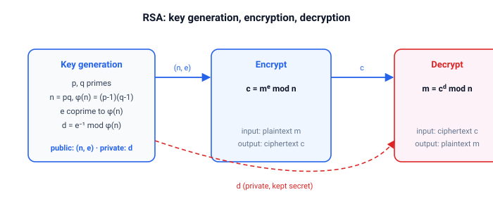

# crypto

Модулярная арифметика на `u64`, учебный RSA с подписью и атаки, которые действительно его взламывают.

Смысл крейта: чтобы доверять криптосистеме, сначала нужно её атаковать.

## Быстрый старт

```bash
cargo test
cargo run --example rsa_demo
cargo run --example common_modulus
cargo run --example malleability
cargo run --example pohlig_hellman
cargo run --example brute_force_caesar
cargo run --example frequency_analysis
```

## Модули

| Модуль    | Назначение                                                                   |
| --------- | ---------------------------------------------------------------------------- |
| `modular` | `gcd`, `egcd`, `mod_inverse`, `mod_pow`                                      |
| `rsa`     | Структура `Rsa`: генерация ключей, шифрование/дешифрование, подпись/проверка |
| `attacks` | Общий модуль, податливость, факторизация, КТО, Pohlig–Hellman                |

## RSA на одной картинке



Генерация ключей из простых $p$ и $q$:

- вычисляет модуль $n = pq$ и $\phi(n) = (p-1)(q-1)$
- подбирает открытую экспоненту $e$, взаимно простую с $\phi(n)$
- выводит закрытую экспоненту $d = e^{-1} \bmod \phi(n)$

Шифрование и дешифрование — это одна и та же операция с разными экспонентами:

$$ c = m^e \bmod n \qquad m = c^d \bmod n $$

Подпись — та же операция с закрытой экспонентой: $s = m^d \bmod n$, а проверка сравнивает $s^e \bmod n$ с $m$.

## API

| Элемент                                 | Назначение                                                                |
| --------------------------------------- | ------------------------------------------------------------------------- |
| `gcd`, `egcd`, `mod_inverse`, `mod_pow` | Алгоритм Евклида, модулярный обратный, быстрое возведение в степень       |
| `Rsa::new`, `encrypt`, `decrypt`        | Учебный RSA на малых числах                                               |
| `Rsa::sign`, `verify`                   | Цифровая подпись с RSA                                                    |
| `attacks::common_modulus_attack`        | Восстановить $m$ из двух шифротекстов с общим $n$                         |
| `attacks::malleable_product`            | $c_1 c_2 = (m_1 m_2)^e \bmod n$                                           |
| `attacks::factorize`                    | Пробное деление, показывающее, почему малые простые множители не подходят |
| `attacks::crt`                          | Китайская теорема об остатках                                             |
| `attacks::pohlig_hellman`               | Дискретный логарифм, когда $p-1$ гладкое                                  |

## Демо

| Демо                 | Идея                                   | Что печатает                                                   |
| -------------------- | -------------------------------------- | -------------------------------------------------------------- |
| `brute_force_caesar` | Шифр Цезаря                            | Все 32 сдвига, открытый текст появляется при сдвиге 3          |
| `frequency_analysis` | Простая замена                         | Частоты букв, самая частая буква шифротекста соответствует «о» |
| `common_modulus`     | Атака с общим модулем на RSA           | $m$ восстановлено без какого-либо закрытого ключа              |
| `malleability`       | Податливость RSA                       | $c_1 c_2$ расшифровывается в $m_1 m_2$                         |
| `pohlig_hellman`     | Дискретный логарифм с гладким порядком | $x$ такое, что $g^x = h \pmod p$                               |
| `rsa_demo`           | RSA                                    | Полный цикл шифрования/дешифрования и подпись/проверка         |

## Тесты

Юнит-тесты покрывают функции модулярной арифметики, цикл RSA с подписью и каждую атаку на её удачном и неудачном случае.
В докомментариях лежат компилируемые примеры: каждая публичная функция проверена doctest-ом из раздела `# Examples`.
