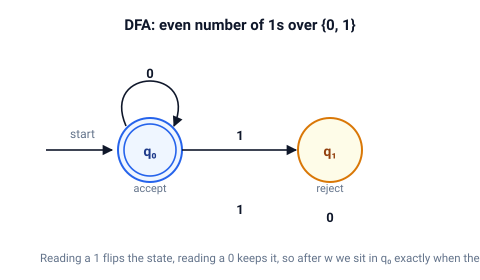

# automata

Finite automata and regular languages.

DFAs, NFAs with epsilon-transitions, the subset construction, and language operations: complement, union, intersection, difference.
Every idea has a runnable demo in `examples/`.

## Quick start

```bash
cargo test
cargo run --example even_ones
```

## The model

A DFA is a tuple $(Q, \Sigma, \delta, q_0, F)$.
It accepts a word $w$ when the extended transition function lands in an accepting state:

$$ L(M) = \{ w \in \Sigma^* \mid \hat\delta(q_0, w) \in F \} $$



The diagram shows the smallest useful example: words over $\{0, 1\}$ with an even number of `1`s.
State $q_0$ is both the start and the only accepting state.
Reading a `1` flips it, reading a `0` keeps it.

An NFA may have several transitions on one symbol, plus epsilon-transitions that move without reading.
A word is accepted when some run over the whole word ends in an accepting state.
The subset construction turns an NFA into an equivalent DFA whose states are the epsilon-closed sets of NFA states.

## Demos

| Demo           | Shows                                                                                       |
| ---            | ---                                                                                         |
| `even_ones`    | A DFA for an even number of `1`s, checked word by word                                      |
| `nfa_to_dfa`   | The subset construction on the NFA for words containing `00` or `11`, with agreement checks |
| `language_ops` | Complement, union, intersection, and difference on two DFAs via the product construction    |

`nfa_to_dfa` determinizes a five-state NFA into a DFA and compares the two machines on every test word.
The verdict `ok` on each line confirms that the subset construction preserved the language.

## API

| Type  | Purpose                                             | Key methods                                                                                             |
| ---   | ---                                                 | ---                                                                                                     |
| `Dfa` | Deterministic automaton                             | `accepts`, `is_empty`, `equivalent_to`, `complete`, `complement`, `union`, `intersection`, `difference` |
| `Nfa` | Nondeterministic automaton with epsilon-transitions | `epsilon_closure`, `accepts`, `to_dfa`                                                                  |

## Tests

```bash
cargo test
```

Unit tests live next to the code in `src/`.
Doc-tests cover every public method.
