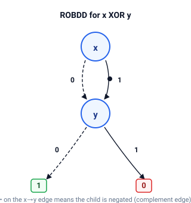

# bdd

Reduced ordered binary decision diagrams (ROBDDs) with complement edges.

A canonical BDD manager: a node table with the unique-node rule, reduction (dropping redundant nodes), and complement edges so negation costs nothing.
The fundamental operation is `ite`, and `and`, `or`, and `xor` are its special cases.
Once the canonical BDD is built, satisfiability, tautology, and equivalence checks are immediate: every function has exactly one representation.

## Quick start

```bash
cargo run --example bdd_demo
cargo run --example var_order
cargo run --example expr_demo
cargo run --example visualize
cargo test
```

## How it works

A BDD represents a boolean function by Shannon expansion: a node `(v, lo, hi)` means "if variable `v` then `hi` else `lo`".
Reduction and node sharing make the representation canonical: for a fixed variable order every function has exactly one ROBDD.
Complement edges store negation as a flag on an edge, so `not` never builds a new node and complement-heavy functions stay compact.



## Demos

| Demo        | Shows                                                                          |
| ----------- | ------------------------------------------------------------------------------ |
| `bdd_demo`  | Building the ROBDD for `x XOR y`, evaluation, `sat_count`, `restrict`          |
| `var_order` | How variable ordering affects BDD size                                         |
| `expr_demo` | Building BDDs from expressions, equivalence, tautology check                   |
| `visualize` | DOT rendering, an indented tree dump, and the complement-free plain form       |

## API

| Item                                             | Purpose                                                              |
| ------------------------------------------------ | -------------------------------------------------------------------- |
| `Bdd::new`                                       | Create a fresh manager with the constant node                        |
| `Bdd::var`                                       | The BDD for a single variable `x_i`                                  |
| `Bdd::not`, `and`, `or`, `xor`                   | Boolean operations built on `ite`                                    |
| `Bdd::ite`                                       | The fundamental ternary operator `ite(f, g, h)`                      |
| `Bdd::eval`                                      | Evaluate the function under a variable assignment                    |
| `Bdd::sat_count`                                 | Count how many assignments satisfy the function                      |
| `Bdd::restrict`                                  | Fix a variable to a value                                            |
| `Bdd::is_tautology`                              | Check whether the function is always true                            |
| `Bdd::is_satisfiable`                            | Check whether the function has at least one model                    |
| `Bdd::size`                                      | Number of nodes in the manager                                       |
| `Bdd::to_dot`                                    | Render the diagram as a Graphviz DOT string                          |
| `Bdd::to_tree_string`                            | Dump the diagram as an indented tree with sharing marks              |
| `Bdd::to_plain`, `PlainBdd`, `PlainNode`         | The complement-free form of a diagram                                |
| `Expr`                                           | Boolean expression AST (`Var`, `Not`, `And`, `Or`, `Xor`, `Implies`) |
| `Expr::to_bdd`                                   | Build the BDD for an expression                                      |

## Tests

Unit tests cover boolean operations against reference truth tables, the unique-table and reduction rules, `sat_count` on several functions, `restrict` with and without complement edges, `ite` base cases, and expression-to-BDD conversion including tautology detection.
