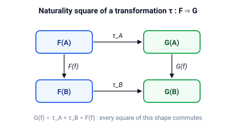

# categories

Конечные категории, функторы, естественные преобразования и биекция Йонеды — всё настолько малое, что проверяется полным перебором.
Категория хранится как список объектов, список именованных морфизмов и полная таблица композиции, поэтому каждый закон превращается в цикл, который можно запустить.

## Быстрый старт

```bash
cargo run --example monoid_category
cargo run --example free_category
cargo run --example yoneda_check
cargo run --example kleisli
cargo test
```

## Идея

В категории есть объекты и морфизмы, и каждую пару $A \xrightarrow{f} B \xrightarrow{g} C$ можно скомпоновать в $g \circ f : A \to C$.
Композиция ассоциативна, а у каждого объекта $A$ есть тождественный морфизм $\mathrm{id}_A$:

$$\mathrm{id}_B \circ f = f = f \circ \mathrm{id}_A$$

Здесь всё конечно: крейт хранит всю таблицу композиции, поэтому проверка закона — это обход таблицы.

### Три строителя

| Строитель         | Категория                         | Морфизмы                                      |
| ----------------- | --------------------------------- | --------------------------------------------- |
| `from_monoid`     | один объект                       | элементы моноида, композиция по таблице Кэли  |
| `from_poset`      | рефлексивное отношение            | ровно один морфизм $a \to b$, когда $a \le b$ |
| `free_from_graph` | ориентированный ациклический граф | пути, `e2*e1` означает $e_2$ после $e_1$      |

`check_axioms` обходит таблицу и проверяет ассоциативность и законы тождества.
Плохая таблица — например, неассоциативное умножение или нетранзитивное отношение — строит категорию, не проходящую проверку.

### Функторы

`Functor` переводит каждый объект и каждый морфизм исходной категории в целевую категорию.
`check` проверяет два закона функтора:

$$F(\mathrm{id}_A) = \mathrm{id}_{F(A)} \qquad F(g \circ f) = F(g) \circ F(f)$$

### Естественные преобразования и Йонеда

`SetFunctor` сопоставляет каждому объекту конечное множество, а каждому морфизму — функцию.
`NaturalTransformation` $\tau : F \Rightarrow G$ сопоставляет каждому объекту компоненту $\tau_A : F(A) \to G(A)$, и естественность требует, чтобы каждый квадрат следующего вида коммутировал:

$$G(f) \circ \tau_A = \tau_B \circ F(f)$$

`natural_transformations` перебирает все семейства компонент и оставляет естественные.

Лемма Йонеды: естественные преобразования из гом-функтора — это в точности элементы $F$ в фокусном объекте:

$$\mathrm{Nat}(\mathrm{Hom}(A, -),\, F) \cong F(A), \qquad \tau \mapsto \tau_A(\mathrm{id}_A)$$

`yoneda` строит левую часть полным перебором и проверяет, что это каноническое отображение — биекция.



### Композиция Клейсли

Для монад Option и List функции `kleisli_option` и `kleisli_vec` компонуют стрелки $A \to T(B)$ и $B \to T(C)$ в стрелку $A \to T(C)$ через монаду, а `unit_option` и `unit_vec` служат единицами.
Ассоциативность композиции и законы единицы проверены на конкретных конвейерах в тестах.

## Демо

| Демо              | Что показывает                                                                    |
| ----------------- | --------------------------------------------------------------------------------- |
| `monoid_category` | $\mathbb{Z}_4$ как категория из одного объекта: таблица композиции — таблица Кэли |
| `free_category`   | шесть путей графа `A -a-> B -b-> C` и склейка путей композицией                   |
| `yoneda_check`    | биекция на моноиде, цепочке $0 < 1 < 2$ и свободной категории графа               |
| `kleisli`         | Option-конвейер с ранними выходами, затем Vec-конвейеры и законы Клейсли          |

## API

| Элемент                           | Что делает                                                            |
| --------------------------------- | --------------------------------------------------------------------- |
| `ObjId` / `Morphism`              | индекс объекта / именованный морфизм с `src` и `dst`                  |
| `FiniteCategory`                  | объекты, морфизмы и полная таблица композиции                         |
| `FiniteCategory::from_monoid`     | категория из одного объекта по моноиду                                |
| `FiniteCategory::from_poset`      | тонкая категория рефлексивного отношения                              |
| `FiniteCategory::free_from_graph` | свободная категория ориентированного ациклического графа              |
| `compose(f, g)` / `identity(o)`   | композиция `g` после `f` / тождественный морфизм объекта              |
| `check_axioms`                    | ассоциативность и законы тождества по всей таблице                    |
| `Functor` / `check`               | образы объектов и морфизмов / два закона функтора                     |
| `SetFunctor` / `check`            | множества и функции над категорией / сохранение тождеств и композиции |
| `hom_functor(cat, a)`             | ковариантный гом-функтор $\mathrm{Hom}(a, -)$                         |
| `natural_transformations`         | все естественные преобразования между двумя Set-функторами, перебором |
| `yoneda(cat, a, f)`               | $\mathrm{Nat}(\mathrm{Hom}(a, -), F)$ и вердикт о биекции             |
| `kleisli_option` / `kleisli_vec`  | композиция через Option / Vec                                         |
| `unit_option` / `unit_vec`        | единицы двух монад                                                    |

## Тесты

`cargo test` запускает четыре интеграционных файла.
`category_test.rs` проверяет аксиомы всех трёх строителей, точечные проверки композиции, неассоциативную таблицу и нетранзитивное отношение, которые обязаны провалить проверку, циклический граф, который обязан паниковать, а также пустую категорию и категорию из одного морфизма.
`functor_test.rs` проверяет законы функтора, включая сдвиг и неверный гом-набор, которые обязаны провалить проверку.
`yoneda_test.rs` прогоняет биекцию Йонеды на трёх категориях и проверяет законы Set-функторов, включая сломанный функтор.
`kleisli_test.rs` проверяет ассоциативность, законы единицы и ранние выходы для обеих монад.
