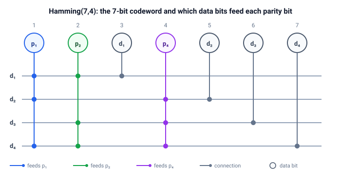

# codes

Error-correcting codes over a binary channel: parity, repetition, and Hamming.

Three code families answer the same question -- "how do I protect bits against
noise?" -- with different amounts of redundancy:

| code | (n, k, d) | rate k/n | detects | corrects | idea |
| --- | --- | --- | --- | --- | --- |
| parity | (7, 6, 2) | 6/7 | 1 | 0 | append one bit so the word has even parity |
| repetition | (3, 1, 3) | 1/3 | 2 | 1 | send each bit three times, majority vote |
| Hamming | (7, 4, 3) | 4/7 | 2 | 1 | parity bits whose positions spell the error |

`(n, k, d)`: n bits per codeword, k data bits, minimum distance d. A code of
distance d detects up to d - 1 errors and corrects up to (d - 1) / 2. All three
detect a single error; repetition and Hamming also correct it, and Hamming does
so at nearly twice the rate.

## Quick start

```bash
cargo run -p codes --example hamming_demo
cargo run -p codes --example codes_compare
cargo run -p codes --example error_scenarios
cargo test -p codes
```

## Hamming(7,4)

Data bits sit at positions 3, 5, 6, 7; parity bits `p1`, `p2`, `p4` at positions 1, 2, 4.
Each parity bit is the xor of the data bits it covers:



Blue circles are computed parity bits, green circles are the data bits from the
message. A dashed line from a data bit down to a row means that bit's value
enters that row's xor. The decoder recomputes the three parities of the
received word; they form a 3-bit syndrome. Zero means "no error", any other
value is exactly the position of the flipped bit:

$$ s = (s_4\, s_2\, s_1)_2 \;\Rightarrow\; \text{flip bit } s $$

## Repetition (3, 1, 3)

Each bit is sent three times; the receiver takes a majority vote. Any single
error is outvoted, two errors are not. The code is the honest naive answer to
noise -- it works, but spends three bits to protect one.

## Parity (n + 1, n, 2)

One parity bit is appended so the word has an even number of ones. A single
flipped bit breaks the check, but the check says nothing about *where* the
error is, so parity detects without correcting.

## Distance and capability

`hamming_distance`, `min_distance`, `detects_up_to`, and `corrects_up_to`
measure a code and say what it buys:

```rust
let d = min_distance(&words);
assert_eq!(detects_up_to(d), 2);   // d - 1
assert_eq!(corrects_up_to(d), 1);  // (d - 1) / 2
```

## API

| Function | Purpose |
| --- | --- |
| `parity_bit` | 1 when the data has an odd number of ones |
| `parity_encode` | Appends the parity bit: (n + 1, n, 2) code |
| `parity_ok` | True when the word passes the even-parity check |
| `repeat_encode` | One bit -> the same bit three times |
| `repeat_decode` | Majority vote over three bits |
| `encode` | 4 data bits -> 7-bit Hamming codeword |
| `syndrome` | 0 for a valid codeword, else the position of a single error |
| `decode` | Corrects a single error and returns the data bits |
| `data_bits` | Extracts the 4 data bits from a 7-bit word |
| `hamming_distance` | Number of differing positions between two bit strings |
| `min_distance` | Smallest pairwise distance over a set of codewords |
| `detects_up_to` | d - 1: errors detected by a code of distance d |
| `corrects_up_to` | (d - 1) / 2: errors corrected by a code of distance d |

`Decoded` reports the recovered data plus how many errors were corrected (0 or 1) and where.

## Tests

```bash
cargo test -p codes
```

For Hamming, every one of the 16 data words is checked against all 7 single-bit
corruptions, and every pair of distinct codewords is checked to differ in at
least 3 positions. For repetition, all 3-bit words are voted on. For parity,
every single-bit corruption of every valid word fails the check. `min_distance`
is verified to give 2, 3, 3 for the three codes.
