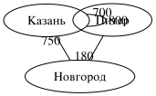

# graphs

Graphs: modeling, algorithms, visualization.

A teaching crate for the graphs chapter: a deliberately simple graph model (no generics, no traits — just `usize` vertex ids, names, and weighted edges), the classic algorithms from the chapter, and several ways to render a graph.

## Quick start

```bash
cargo run -p graphs --example bfs_dfs
cargo run -p graphs --example visualize
cargo test -p graphs
```

## The model

A `Graph` stores its data twice, and both views are public:

- `edges` — the edge list `(from, to, weight)`, read by weighted algorithms (Dijkstra, Bellman–Ford, Kruskal);
- `adj` — adjacency lists `adj[u] = [(neighbor, edge_id), ...]`, read by traversals (BFS, DFS).

Vertices are `usize` ids `0..n` with optional string names. Edges are directed or undirected depending on the `directed` flag, and may repeat (multigraphs). The duplication is intentional: it mirrors how the chapter's pseudocode thinks about a graph, and it keeps every algorithm short.



The figure above is not hand-drawn: it is the output of `graphs::viz::svg::render` (see the `visualize` demo).

## API

### Graph (`graph.rs`)

| Method | Purpose |
| --- | --- |
| `Graph::undirected()`, `Graph::directed()` | New empty graph |
| `add_node(name)` | Add a vertex, return its id |
| `add_edge(u, v)`, `add_weighted_edge(u, v, w)` | Add an edge, return its id |
| `add_edges(&[(u, v), ...])` | Add several unit-weight edges |
| `node_count()`, `edge_count()`, `is_directed()` | Basic facts |
| `node_name(u)`, `neighbors(u)`, `degree(u)` | Read the structure |
| `edge_weight(e)`, `adjacent(u, v)` | Edge lookups |
| `degrees()` | All degrees (handshake lemma, histograms) |
| `Graph::erdos_renyi(n, p, seed)` | Random graph $G(n, p)$, reproducible |

### Algorithms (`algo.rs`)

| Function | Result |
| --- | --- |
| `bfs(&g, start)` | Order, distances, parents (BFS tree) |
| `dfs(&g)` | Entry/exit times `pre`/`post`, DFS forest, finish order |
| `connected_components(&g)` | Component count and labels (weak for directed) |
| `strongly_connected_components(&g)` | Kosaraju, for directed graphs |
| `is_cyclic(&g)` | Cycle detection (union-find / DFS colors) |
| `topological_sort(&g)` | Kahn's algorithm, `None` on a cycle |
| `dijkstra(&g, start)` | Shortest paths, non-negative weights |
| `bellman_ford(&g, start)` | Shortest paths with negative edges, `None` on a negative cycle |
| `min_spanning_tree(&g)` | Kruskal's algorithm, returns edge ids |
| `find_eulerian_path(&g)` | Eulerian trail via Hierholzer, `None` if none exists |
| `is_bipartite(&g)` | 2-coloring, `None` on an odd cycle |
| `bridges(&g)`, `articulation_points(&g)` | Tarjan's lowlink algorithm |
| `greedy_coloring(&g)` | Vertex coloring, greedy order |
| `distance`, `eccentricity`, `diameter` | Unweighted distance measures |

### Visualization (`viz/`)

All backends are pure text output — no external dependencies:

| Backend | Output | Open with |
| --- | --- | --- |
| `viz::svg::render` | A standalone SVG document | any browser |
| `viz::dot::render` | Graphviz DOT source | `dot -Tsvg g.dot -o g.svg` |
| `viz::cytoscape::render` | cytoscape.js JSON | the `elements` option of `cytoscape()` |
| `viz::html::render` | A full HTML page with the SVG inside | any browser |

## Demos

| Demo | Shows |
| --- | --- |
| `bfs_dfs` | BFS layers and distances; DFS entry/exit times on the chapter's graph |
| `dijkstra` | Dijkstra vs Bellman–Ford, negative edges, negative cycles, path reconstruction |
| `mst` | Kruskal's minimum spanning tree on a weighted graph |
| `structure` | Components, bridges, articulation points, bipartiteness, diameter |
| `directed` | Topological sort, cycle detection, strongly connected components |
| `euler` | The Euler criterion and Hierholzer's trail |
| `visualize` | One graph rendered to SVG, DOT, cytoscape JSON, and HTML |
| `random_graph` | Erdős–Rényi $G(n, p)$: degrees, handshake lemma, components, SVG |

## Integration paths (web, wasm, js, desktop)

The four backends cover the easy routes; the same data feeds the harder ones:

- **web**: inline the SVG (`viz::html`), or feed the JSON to cytoscape.js for pan/zoom/click;
- **wasm / js**: compile the crate with `wasm-pack`, expose `Graph` + algorithms, and render with the same backends on the JS side;
- **bevy / egui**: skip the text backends and draw `g.adj`/`g.edges` directly — the model is just `Vec`s, so it transfers to any renderer;
- **graphviz**: `viz::dot` output works with `dot`, `neato`, `fdp` and the other layout engines.

## Tests

```bash
cargo test -p graphs
```

Every algorithm has hand-checked cases next to the code in `src/`: BFS distances on a square, Dijkstra's shortcut through a middle vertex, the Euler criterion (circuit vs path vs none), bridges/articulation points of a path, and so on.
