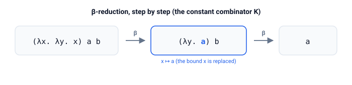

# lambda

Untyped λ-calculus.

Terms, capture-avoiding substitution, β-reduction under three strategies
(normal order, applicative order, weak head normal form), Church encodings
(numerals, booleans, pairs), well-known combinators (SKI, Ω), fixed-point
combinators (Y, Z) with a factorial built from Z, and a tiny simply-typed
layer.

## Quick start

```bash
cargo run -p lambda --example church_arith
cargo run -p lambda --example combinators
cargo run -p lambda --example beta_trace
cargo run -p lambda --example fixpoint
cargo test -p lambda
```

## The core operation

β-reduction feeds an argument into a binder, replacing each free occurrence of the bound variable:

$$ (\lambda x.\; M)\; N \;\to_\beta\; M[x := N] $$

Substitution is capture-avoiding: when a free variable of $N$ would be captured by a binder, the binder is α-renamed first.



The diagram reduces the constant combinator step by step: $(\lambda x.\,\lambda y.\,x)\;a\;b$.

## Modules

| Module | Contents |
|--------|----------|
| `term` | `Term` (Var, Abs, App), constructors, printing, free variables |
| `subst` | Capture-avoiding substitution `M[x := N]`, α-conversion `rename` |
| `eval` | Reduction strategies and fuel-limited drivers with step counters |
| `church` | Church numerals, booleans, pairs, zero test, predecessor |
| `combinators` | I, K, S, self-application ω, non-terminating Ω |
| `fixpoint` | Y (call-by-name) and Z (call-by-value) fixed-point combinators, factorial |
| `stlc` | Tiny simply-typed layer: `Ty`, `STerm`, type checker, type erasure |

## API

| Item | Purpose |
|------|---------|
| `Term` | A λ-term: `Var`, `Abs`, `App` |
| `Term::var` / `Term::abs` / `Term::app` | Constructors |
| `Term::free_vars` | Free variables of a term |
| `Term::substitute` | Capture-avoiding substitution $M[x := N]$ |
| `Term::rename` | α-conversion (rename bound variable) |
| `Term::beta_reduce` | One normal-order β-step; `None` at a normal form |
| `Term::beta_reduce_applicative` | One applicative-order β-step (leftmost innermost) |
| `Term::whnf_step` | One step toward weak head normal form |
| `Term::normalize` | Normal-order reduction to normal form, fuel-limited |
| `Term::normalize_applicative` | Applicative-order reduction, fuel-limited |
| `Term::whnf` | Weak-head reduction, fuel-limited |
| `Term::reduce_normal` / `reduce_applicative` / `reduce_whnf` | Same, returning a `Reduction` with a step counter |
| `Reduction` | `{ term, steps, converged }` -- term reached, steps taken, fuel status |
| `Term::trace` / `trace_applicative` | Step-by-step reduction traces |
| `Term::is_normal_form` / `is_whnf` | Normal-form predicates |
| `church` / `to_nat` | Church numerals and reading their value back |
| `succ` / `add` / `mult` / `power` | Arithmetic on Church numerals |
| `is_zero` / `pred` | Zero test and predecessor (pair-shift) |
| `church_true` / `church_false` | Church booleans |
| `and` / `or` / `not` / `ifthenelse` | Boolean logic |
| `church_to_bool` | Interpret a Church boolean back to `bool` |
| `pair` / `fst` / `snd` | Church pairs and projections |
| `i` / `k` / `s` | SKI combinators (S and K form a basis) |
| `self_app` / `omega` | Self-application ω and non-terminating Ω |
| `y` | Call-by-name Y fixed-point combinator |
| `z` | Call-by-value Z fixed-point combinator |
| `fact` / `fact_step` | Factorial as a fixed point of `Fact` (and `Fact` itself) |
| `Ty` / `STerm` | Simply-typed terms: `Base`, `Arrow`, annotated binders |
| `STerm::erase` | Erase types to the untyped `Term` |
| `STerm::infer` / `type_of` | Type check against a context / the empty context |
| `TypeError` | Why a typed term failed to check |

## Reduction strategies

All drivers are fuel-limited (`max_steps`) so diverging terms like Ω cannot
hang the process, and report their progress as a `Reduction` with a step
counter.

- **Normal order** (leftmost outermost) -- if a normal form exists, normal
  order finds it.
- **Applicative order** (leftmost innermost) -- evaluates arguments first;
  can loop where normal order terminates, e.g. on `(λx. y) Ω`.
- **Weak head normal form** -- stops once the head is a variable or a
  binder; redexes inside arguments are left alone.

## Fixed points

Recursion in λ-calculus is a *fixed point*: `X` with `X = F X`. The
call-by-name combinator `Y = λf. (λx. f (x x)) (λx. f (x x))` unfolds as
`Y F → F (Y F)`. The call-by-value combinator `Z = λf. (λx. f (λv. x x v))
(λx. f (λv. x x v))` adds a `λv` wrapper so the recursive expansion is
delayed until an argument arrives. The factorial `fact = Z Fact` computes
`3! = 6` in about 1500 pure β-steps (naive substitution is exponential --
real implementations share subterms).

## Demo

| Demo | Shows |
|------|-------|
| `church_arith` | Church numerals: succ, add, mult, power (2^4 = 16, etc.) |
| `combinators` | I, K, S combinators; SKK = I; Ω non-termination |
| `beta_trace` | Step-by-step reduction trace; Ω with step limit; Church arithmetic with trace |
| `fixpoint` | Y unfolds `Y K → K (Y K) → λx. x`; factorial via Z |

## Tests

```bash
cargo test -p lambda
```
