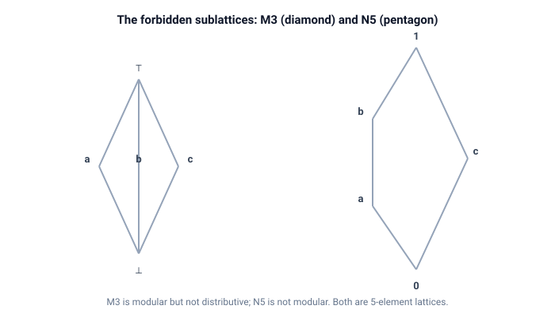

# lattices

Lattices and partial orders.

Finite lattices given by an explicit order, with the join (supremum) and meet (infimum) of a pair.
The structural properties checked are distributivity, modularity, and the Birkhoff characterization: a lattice is distributive exactly when it contains no sublattice isomorphic to M3 (the diamond) or N5 (the pentagon).

## Quick start

```bash
cargo test
cargo run --example join_meet
cargo run --example birkhoff
```

## The idea

A lattice is a finite set with a partial order in which every pair of elements has a join (supremum: the least upper bound) and a meet (infimum: the greatest lower bound).

- A lattice is *distributive* when $a \wedge (b \vee c) = (a \wedge b) \vee (a \wedge c)$ for every triple.
- A lattice is *modular* when $a \vee (b \wedge c) = (a \vee b) \wedge c$ whenever $a \le c$.
- *Birkhoff's characterization*: distributive if and only if no sublattice is isomorphic to M3 or N5.
  The diamond M3 is modular but not distributive.
  The pentagon N5 is not even modular.

The crate checks the laws directly and also searches for the forbidden sublattices, so the characterization can be verified on the built-in examples.

## Demos

| Demo        | What it shows                                                                                                |
| ----------- | ------------------------------------------------------------------------------------------------------------ |
| `join_meet` | Upper and lower bounds, join and meet on the divisors of 12, where the join of {2, 3} is 6 and the meet is 1 |
| `birkhoff`  | Distributivity and modularity of `D_12`, `B_3`, M3 and N5, plus the M3/N5 sublattice search                  |

`join_meet` walks a few pairs of the divisor lattice and prints their bounds, join and meet.
The second half derives the same poset from the divisibility predicate and reduces it to the Hasse diagram, the cover relation.
`birkhoff` runs both distributivity checks on the four running examples and confirms that the laws and the forbidden-sublattice search agree.

## API

| Item                                                     | What it does                                                                 |
| -------------------------------------------------------- | ---------------------------------------------------------------------------- |
| `Lattice`                                                | A finite lattice: `elements` plus the `<=` relation as an explicit pair list |
| `le(a, b)`                                               | Whether `a <= b`                                                             |
| `upper_bounds(a, b)` / `lower_bounds(a, b)`              | Common upper / lower bounds of a pair                                        |
| `join(a, b)` / `meet(a, b)`                              | Supremum / infimum of a pair, `None` if missing                              |
| `is_lattice()`                                           | Whether every pair has a join and a meet                                     |
| `bottom()` / `top()`                                     | The least / greatest element, if present                                     |
| `is_chain()`                                             | Whether every pair is comparable                                             |
| `is_distributive()` / `is_modular()`                     | Check the lattice laws for every triple                                      |
| `has_m3_sublattice()` / `has_n5_sublattice()`            | Forbidden sublattice search                                                  |
| `is_distributive_birkhoff()`                             | The Birkhoff characterization as a single check                              |
| `relation_pairs(n, leq)`                                 | The relation `{(i, j) : leq(i, j)}` as an explicit pair list                 |
| `hasse(pairs)`                                           | The Hasse diagram (cover relation): transitive and reflexive pairs removed   |
| `hasse_reflexive(pairs)`                                 | The same, but keeps the reflexive pairs to match the `Lattice` pair format   |
| `examples::m3()`, `n5()`, `divisors_12()`, `boolean_3()` | The running examples                                                         |



## Tests

The unit tests check each running example: M3 is modular but not distributive, N5 is not modular, the divisor and Boolean lattices are distributive, and the Birkhoff search agrees with the distributive law on all four.
