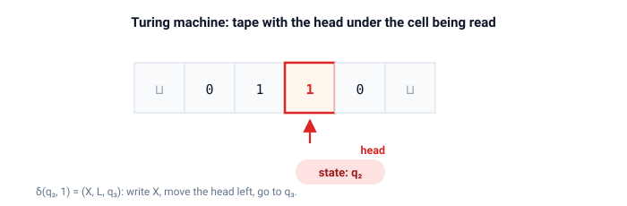

# turing

Turing machines.

A concrete model: a tape held as two stacks, a transition table, accepting and rejecting states, and a trace of every configuration the machine visits.
The design follows the mathematical definition, not any specific hardware.

## Quick start

```bash
cargo test
cargo run --example zero_n_one_n
cargo run --example binary_increment
cargo run --example palindrome
```

## The machine

A transition reads the symbol under the head, writes a new one, moves the head, and switches state:

$$ \delta(q, a) = (q', b, d), \qquad d \in \{L, R, S\} $$

A run records every configuration and stops at an accepting or a rejecting state.

### Outcomes

| Outcome    | Meaning                                                    |
| ---------- | ---------------------------------------------------------- |
| `Accepted` | an accepting state was reached                             |
| `Rejected` | a rejecting state was reached                              |
| `Stuck`    | no transition applies: the machine halts without a verdict |
| `Limit`    | `max_steps` transitions taken before the machine halted    |

`Limit` is an engineering substitute for non-termination, not a theoretical outcome.
Whether a machine halts at all is undecidable, so a finite run simply gives up after `max_steps`.

### The tape



The tape cells live in two stacks (`left`, `right`) with the head between them.
Moving the head is moving a symbol between the stacks, so every operation costs $O(1)$.
Never-visited cells hold the blank symbol, and `content_trimmed` strips the leading and trailing blanks after a run.

## Example machines

| Function                       | Language or function computed                               |
| ------------------------------ | ----------------------------------------------------------- |
| `machines::ends_with_zero()`   | Words over $\{0, 1\}$ that end in `0`                       |
| `machines::zero_n_one_n()`     | The language $0^n 1^n$, by crossing out matching pairs      |
| `machines::binary_increment()` | Increments a binary number, least significant bit first     |
| `machines::palindrome()`       | Words over $\{0, 1\}$ that read the same in both directions |

## API

| Item                            | Purpose                                                                                            |
| ------------------------------- | -------------------------------------------------------------------------------------------------- |
| `Tape`                          | Infinite tape with a head, modelled as two stacks (`left`, `right`)                                |
| `Direction`                     | `Left`, `Right`, or `Stay`                                                                         |
| `Transition`                    | Write symbol, move head, go to next state                                                          |
| `Configuration`                 | Current state plus a tape snapshot                                                                 |
| `Machine`                       | Transition table plus start, accept, and reject states                                             |
| `Machine::run(tape, max_steps)` | Run with a step limit: a non-halting machine ends with `Outcome::Limit` instead of running forever |
| `Machine::next(config)`         | Compute the next configuration, or `None` if stuck                                                 |
| `Run`, `Outcome`                | The full trace and its verdict: see the outcomes table above                                       |
| `Tape::content()`               | The full tape content as a `Vec`                                                                   |
| `Tape::content_trimmed()`       | Tape content with leading and trailing blanks removed                                              |

## Demos

| Demo               | Shows                                                                       |
| ------------------ | --------------------------------------------------------------------------- |
| `zero_n_one_n`     | The crossing-out algorithm for $0^n 1^n$, with a full trace on `0011`       |
| `binary_increment` | Step-by-step binary increment on several inputs, including overflow         |
| `palindrome`       | Palindrome checking with comparison traces: one accepted word, one rejected |

## Tests

Unit tests live next to the code in `src/`.
Each example machine is checked against accept/reject word lists, the $0^n 1^n$ trace is checked configuration by configuration, binary increment is checked digit by digit on eight inputs, and a machine that moves right forever ends with `Limit`.
Doc-tests run one scenario per public item.
